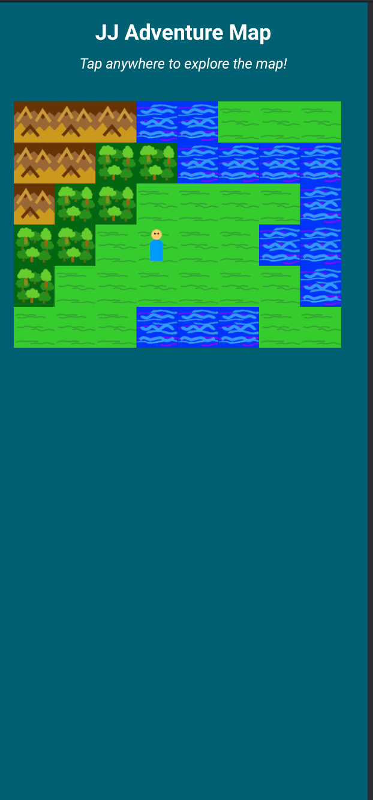
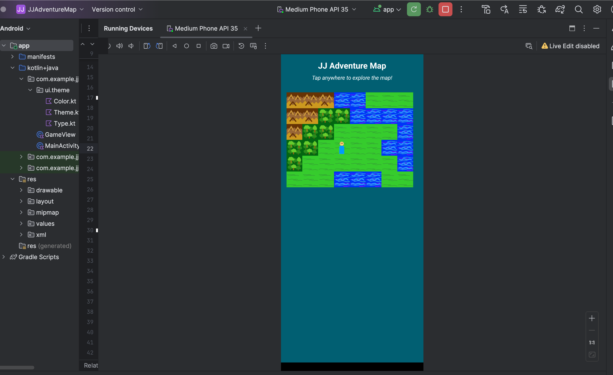
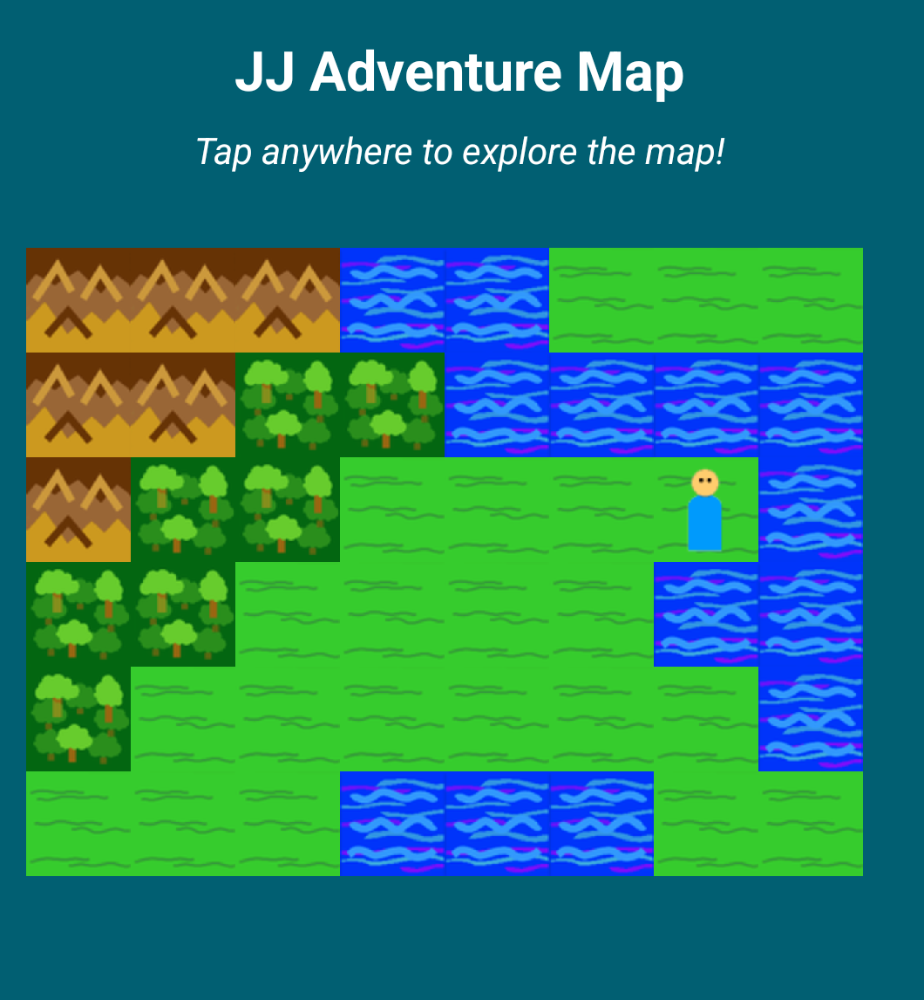
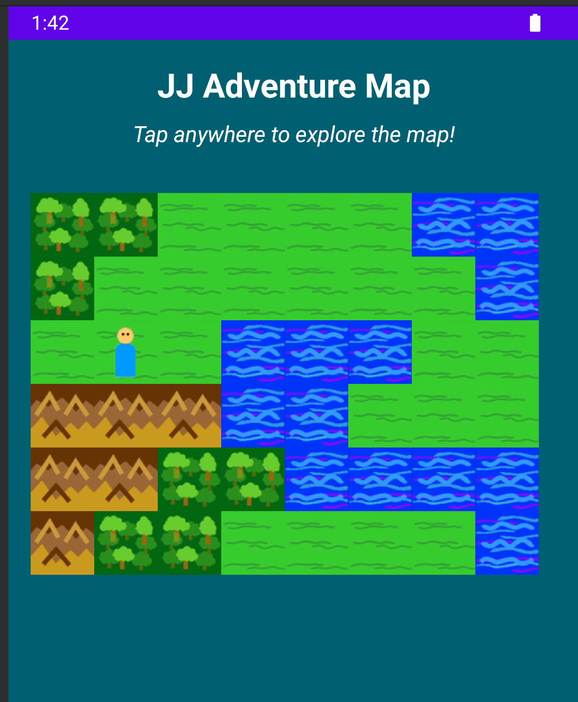

# JJAdventureMap

A touch-driven Android adventure game featuring a custom tile map, smooth scrolling, and dynamic player movement. Built with Kotlin and custom drawing logic, this project demonstrates real-time map rendering, touch navigation, and a modular game architecture.

## Key Features

- **Custom Tile Map Engine**: Renders a multi-tile world with forests, mountains, water, plains, and treasures using a simple ASCII map.
- **Touch Navigation**: Move your player by tapping anywhere on the map—supports intuitive, direct control.
- **Smooth Scrolling**: The map scrolls automatically as the player approaches the edge of the visible area, keeping the action centered.
- **Dynamic Tile Rendering**: Each tile type (forest, mountain, water, plain, treasure) is rendered with a unique bitmap for visual clarity.
- **Player Avatar**: The player is represented by a custom sprite and always drawn above the map tiles.
- **Robust Bounds Checking**: Prevents movement outside the map and logs invalid actions for debugging.
- **Modular GameView**: All game logic is encapsulated in a single, reusable `GameView` class.

## Demo Gallery

Below are screenshots of JJAdventureMap running in the Android Studio emulator:






## YouTube Demo

[](https://youtu.be/YrR7m8snaIQ)

<details>
<summary>Click to play the video inline</summary>

[](https://youtu.be/YrR7m8snaIQ)

</details>

---

## Technical Highlights

### 1. GameView: Custom Map Rendering & Player Movement
```kotlin
class GameView(context: Context) : View(context) {
    // ...existing code...
    override fun onDraw(canvas: Canvas) {
        super.onDraw(canvas)
        drawMap(canvas)
        drawPlayer(canvas)
    }
    // ...existing code...
    override fun onTouchEvent(event: MotionEvent): Boolean {
        if (event.action == MotionEvent.ACTION_UP) {
            val x = (event.x / tileSize).toInt() + offsetX
            val y = (event.y / tileSize).toInt() + offsetY
            if (x in 0 until mapWidth && y in 0 until mapHeight) {
                movePlayer(x, y)
            }
        }
        return true
    }
    // ...existing code...
}
```

### 2. Tile System & Map Data
```kotlin
private val tileMap = listOf(
    "MMM~~........~~~~",
    "MMff~~~~.....~~~~",
    // ...more rows...
)
// Each character represents a tile: M=Mountain, f=Forest, ~=Water, .=Plain, t=Treasure
```

### 3. Smooth Scrolling Logic
```kotlin
private fun adjustOffset() {
    if (playerX < offsetX + 1 && offsetX > 0) offsetX--
    else if (playerX > offsetX + screenWidth - 2 && offsetX + screenWidth < mapWidth) offsetX++
    if (playerY < offsetY + 1 && offsetY > 0) offsetY--
    else if (playerY > offsetY + screenHeight - 2 && offsetY + screenHeight < mapHeight) offsetY++
}
```

## How to Use

1. **Launch the App**: The map and player will appear automatically.
2. **Move the Player**: Tap anywhere on the map to move the player to that tile.
3. **Explore**: The map scrolls as you move, revealing new areas and treasures.
4. **Customize**: Modify the tile map or add new tile types for more adventure!

## Project Structure

- `GameView.kt`: All map rendering, player movement, and touch logic.
- `MainActivity.kt`: Sets up the UI and adds the game view to the layout.
- `images/`: Contains screenshots for documentation.
- `res/drawable/`: Bitmap assets for each tile and the player.

## Academic Integrity

This code is my original work for UVU. Do not copy or submit as your own—doing so may result in academic consequences.
