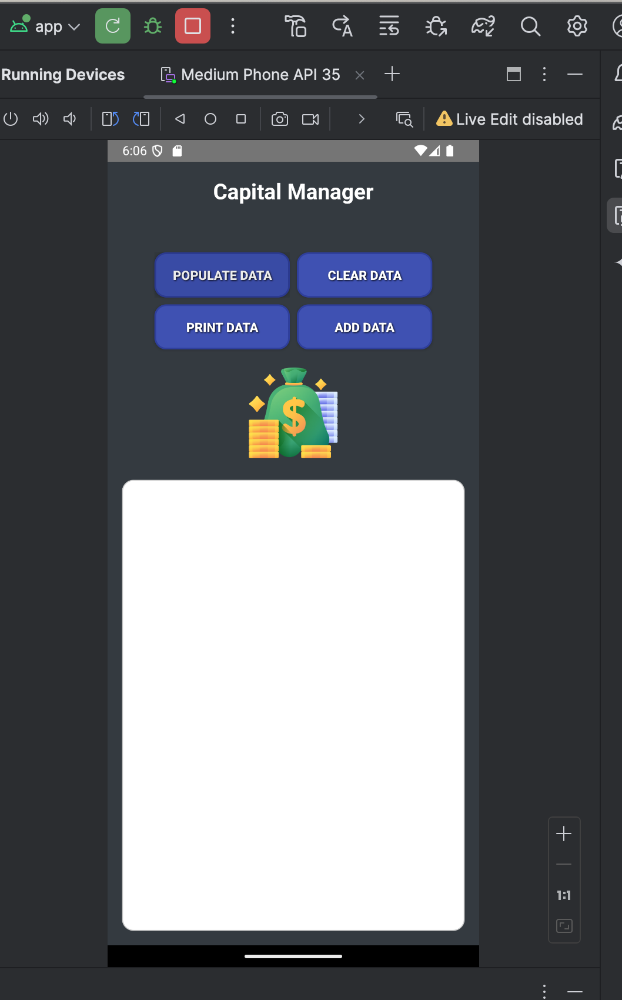
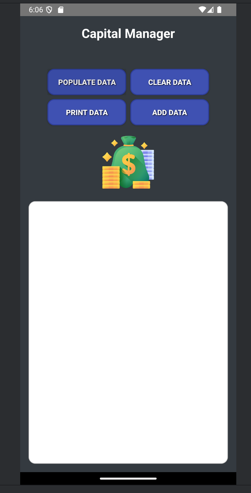
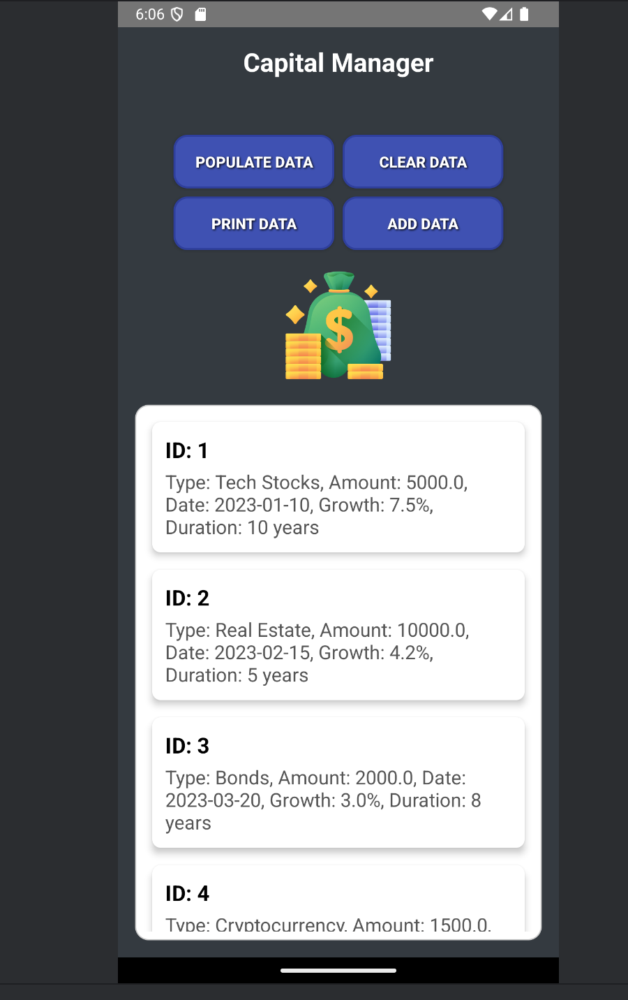

# JJCapitalManager

A robust Android app for managing and tracking investments.

## Key Features

- **SQLite Database**: Manages investments and their details with normalized tables and JOIN queries.
- **Dynamic RecyclerView**: Displays combined investment data, supports add/edit/delete with real-time updates.
- **Dialog-Driven UX**: All CRUD operations are handled via dialogs for a seamless user experience.
- **Sample Data & Reset**: Populate or clear the database with a single tap for easy testing and demos.

## Technical Highlights

### 1. Database Design & Querying

- **Normalized Schema**: Two tables (`investments`, `investment_details`) with foreign key constraints.
- **Non-trivial SQL**: Uses JOINs to efficiently display and filter investment data.
- **Robust Initialization**: Handles schema mismatches and ensures reliable first-run experience.

### 2. Responsive UI & Architecture

- **Coroutines & lifecycleScope**: All DB operations run off the main thread, ensuring a smooth UI.
- **Live RecyclerView Updates**: UI reflects DB changes instantly after add/edit/delete.
- **Dialog Fragments**: Modular dialogs for adding, editing, and viewing investment details.

### 3. Problem Solving

- **DB Initialization Crashes**: Solved by rigorous schema checks and uninstall/reinstall testing.
- **UI Not Updating**: Fixed by using coroutines and main-thread updates for RecyclerView.

## Why This Project Stands Out

- **Real-World Architecture**: Mimics production patterns (separation of concerns, async DB, modular UI).
- **Complex SQL**: Demonstrates ability to write and debug JOINs and filtered queries.
- **User-Centric Design**: All actions are accessible, intuitive, and robust against edge cases.

## How to Use

1. **Add Investment**: Tap "Add" and fill out the dialog.
2. **Edit/Delete**: Tap an item, then update or delete in the detail dialog.
3. **Populate/Clear**: Use the respective buttons to fill or reset the database.
4. **View Details**: Tap any investment for full info and actions.


## Demo Gallery (Android Studio Emulator)

Below are screenshots of the app running in the Android Studio emulator:






## Core Implementation Snippets

### Database Table Creation (DBHelper.kt)
```kotlin
override fun onCreate(db: SQLiteDatabase?) {
	val createTable1 = """
		CREATE TABLE investments (
			id INTEGER PRIMARY KEY AUTOINCREMENT,
			investment_type TEXT NOT NULL,
			amount REAL NOT NULL,
			date TEXT NOT NULL
		);
	""".trimIndent()

	val createTable2 = """
		CREATE TABLE investment_details (
			id INTEGER PRIMARY KEY AUTOINCREMENT,
			investment_id INTEGER NOT NULL,
			growth_rate REAL NOT NULL,
			duration_years INTEGER NOT NULL,
			FOREIGN KEY (investment_id) REFERENCES investments(id)
		);
	""".trimIndent()

	db?.execSQL(createTable1)
	db?.execSQL(createTable2)
}
```

### Adding a New Investment (DBHelper.kt)
```kotlin
fun addInvestment(type: String, amount: Double, date: String, growth: Double, duration: Int) {
	val db = this.writableDatabase
	val investmentValues = ContentValues()
	investmentValues.put("investment_type", type)
	investmentValues.put("amount", amount)
	investmentValues.put("date", date)
	val investmentId = db.insert("investments", null, investmentValues)

	val detailValues = ContentValues()
	detailValues.put("investment_id", investmentId)
	detailValues.put("growth_rate", growth)
	detailValues.put("duration_years", duration)
	db.insert("investment_details", null, detailValues)
}
```

### RecyclerView Adapter Binding (MyRecyclerAdapter.kt)
```kotlin
override fun onBindViewHolder(holder: ViewHolder, position: Int) {
	val data = dataList[position]
	val parts = data.split(", ", limit = 2)
	holder.itemTitle.text = parts[0]
	holder.itemDetails.text = parts.getOrNull(1) ?: "No details available."
	holder.itemView.setOnClickListener {
		onItemClicked(position + 1)
	}
}
```

### Investment Data Model (Investment.kt)
```kotlin
data class Investment(
	val id: Int,
	val type: String,
	val amount: Double,
	val growthRate: Double,
	val durationYears: Int,
	val date: String
)
```

## Notable SQL

```sql
-- Join all investment data for display
SELECT investments.id, investments.investment_type, investments.amount, investments.date,
	   investment_details.growth_rate, investment_details.duration_years
FROM investments
JOIN investment_details ON investments.id = investment_details.investment_id;
```

## Academic Integrity

This code is my original work for UVU. Do not copy or submit as your own—doing so may result in academic consequences.