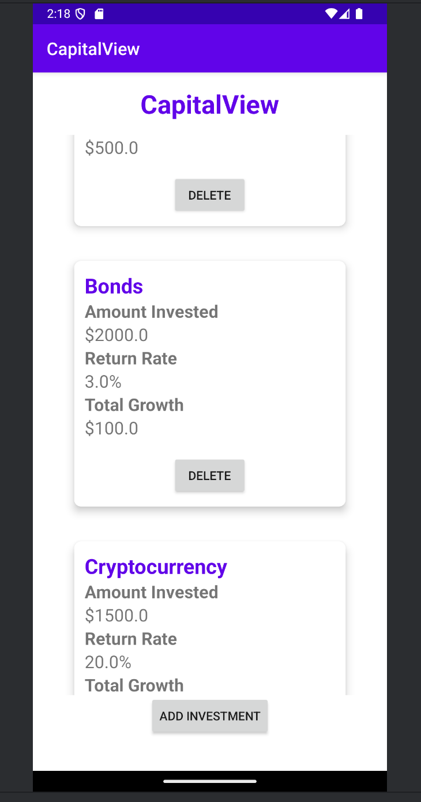
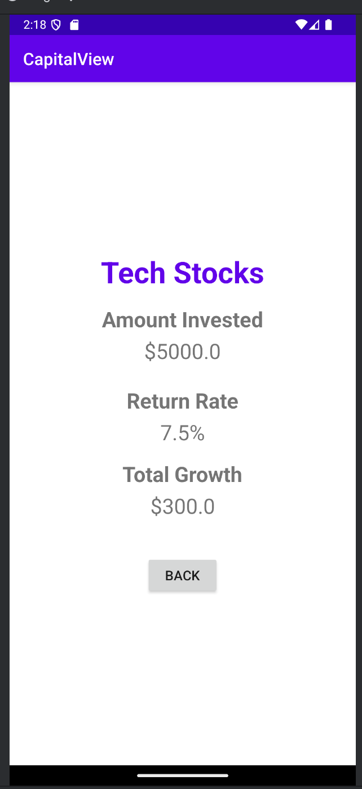

# JJInvestmentTracker

A modern Android app for tracking and managing investments, featuring a dynamic RecyclerView, modular architecture, and robust add/delete functionality. Built with Kotlin, this project demonstrates clean separation of concerns, parcelable data models, and a user-friendly interface for investment management.

## Key Features

- **Modular Investment Manager**: All investment logic is encapsulated in the `InvestmentManager` class for easy extension and testing.
- **Dynamic RecyclerView**: Investments are displayed in a scrollable list with real-time updates on add/delete.
- **Add & Delete Investments**: Users can add new investments via a dedicated activity and delete them instantly from the list.
- **Parcelable Data Model**: The `Investment` class implements `Parcelable` for seamless data transfer between activities.
- **Dummy Data Initialization**: App starts with 12+ diverse investment types for demo and testing.
- **Detail View**: Tap any investment to view its details in a separate activity.
- **Separation of Concerns**: UI, data, and logic are cleanly separated for maintainability.

## Demo Gallery

Below are screenshots of JJInvestmentTracker running in the Android Studio emulator:






---

## Technical Highlights

### 1. InvestmentManager: Centralized Data Logic
```kotlin
class InvestmentManager {
    private val investmentList = mutableListOf<Investment>()
    fun initializeList(investments: List<Investment>) { /* ... */ }
    fun addInvestment(investment: Investment) { /* ... */ }
    fun deleteInvestmentById(id: Int): Boolean { /* ... */ }
    fun getAllInvestments(): MutableList<Investment> { /* ... */ }
}
```

### 2. InvestmentAdapter: RecyclerView with Actions
```kotlin
class InvestmentAdapter(
    private val investments: MutableList<Investment>,
    private val onItemClick: (Investment) -> Unit,
    private val onDeleteClick: (Investment) -> Unit
) : RecyclerView.Adapter<InvestmentAdapter.InvestmentViewHolder>() {
    // ...existing code...
}
```

### 3. MainActivity: Add, Delete, and List Investments
```kotlin
class MainActivity : AppCompatActivity() {
    // ...existing code...
    val adapter = InvestmentAdapter(
        investments = investmentManager.getAllInvestments(),
        onItemClick = { /* show details */ },
        onDeleteClick = { /* delete investment */ }
    )
    recyclerView.adapter = adapter
    // ...existing code...
}
```

### 4. Investment Model: Parcelable for Easy Passing
```kotlin
data class Investment(
    val investmentId: Int,
    val investmentName: String,
    val amountInvested: Double,
    val returnRate: Float,
    val totalGrowth: Double
) : Parcelable { /* ... */ }
```

## How to Use

1. **Launch the App**: The investment list is populated with sample data.
2. **Add Investment**: Tap the add button to enter a new investment.
3. **View Details**: Tap any investment to see its details.
4. **Delete Investment**: Tap the delete button to remove an investment instantly.
5. **Customize**: Extend the data model or UI for more features!

## Project Structure

- `MainActivity.kt`: Main UI, add/delete logic, and dummy data initialization.
- `InvestmentManager.kt`: Centralized investment data logic.
- `InvestmentAdapter.kt`: RecyclerView adapter for displaying and managing investments.
- `Investment.kt`: Parcelable data model for investments.
- `images/`: Contains screenshots for documentation.

## Academic Integrity

This code is my original work for UVU. Do not copy or submit as your own—doing so may result in academic consequences.
