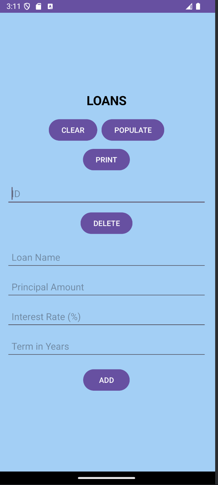

# JJLoanManager

A comprehensive Android app for managing, analyzing, and visualizing loans. Features include modular loan management, amortization schedule generation, sorting, and detailed loan analytics—all powered by Kotlin and coroutines for responsive performance.

## Key Features

- **Modular Loan Manager**: All loan logic is encapsulated in the `LoanManager` class for easy extension and testing.
- **Amortization Schedule**: Generates a detailed month-by-month amortization schedule for any loan.
- **Loan Sorting**: Instantly sort loans by principal, interest rate, or term length.
- **Detailed Analytics**: Calculates monthly payments, total interest, and provides detailed loan breakdowns.
- **Coroutine-Driven**: Heavy computations and data processing run off the main thread for smooth UI.
- **Demo Data**: App starts with 12+ diverse loan types for demo and testing.

## Demo Gallery

Below is a screenshot of JJLoanManager running in the Android Studio emulator:



---

## Technical Highlights

### 1. LoanManager: Centralized Data Logic
```kotlin
class LoanManager {
	fun calculateMonthlyPayment(loan: Loan): Double { /* ... */ }
	fun calculateTotalInterest(loan: Loan): Double { /* ... */ }
	fun generateAmortizationSchedule(loan: Loan) { /* ... */ }
	fun sortLoansBy(criteria: String) { /* ... */ }
	// ...other methods...
}
```

### 2. Amortization Schedule Generation
```kotlin
fun generateAmortizationSchedule(loan: Loan) {
	// Calculates the monthly loan payment
	val monthlyPayment = calculateMonthlyPayment(loan)
	// ...prints month-by-month breakdown...
}
```

### 3. Coroutine Usage for Responsiveness
```kotlin
CoroutineScope(Dispatchers.IO).launch {
	processLoans()
}
```

### 4. Loan Data Model
```kotlin
data class Loan(
	val uniqueID: Int,
	val loanName: String,
	val principalAmount: Double,
	val interestRate: Float,
	val termInYears: Int
)
```

## How to Use

1. **Launch the App**: The loan list is populated with sample data.
2. **Analyze Loans**: View all loans, sort by criteria, and see detailed analytics.
3. **Generate Amortization**: Select a loan to view its full amortization schedule.
4. **Add/Delete Loans**: Easily add or remove loans for custom scenarios.
5. **Customize**: Extend the data model or UI for more features!

## Project Structure

- `MainActivity.kt`: Main UI, coroutine logic, and demo data initialization.
- `LoanManager.kt`: Centralized loan data logic and analytics.
- `Loan.kt`: Data model for loans.
- `images/`: Contains screenshots for documentation.

## What Makes JJLoanManager Unique

- **Full Loan Analytics**: Not just a calculator—provides full breakdowns, amortization, and sorting.
- **Coroutine-Driven**: Handles heavy calculations off the main thread for a responsive experience.
- **Extensible Design**: Easy to add new analytics, loan types, or UI features.

## Academic Integrity

This code is my original work for UVU. Do not copy or submit as your own—doing so may result in academic consequences.
