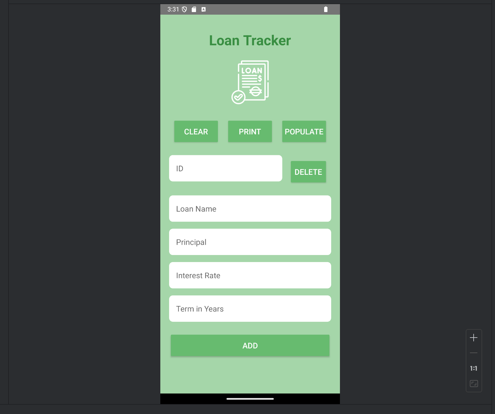
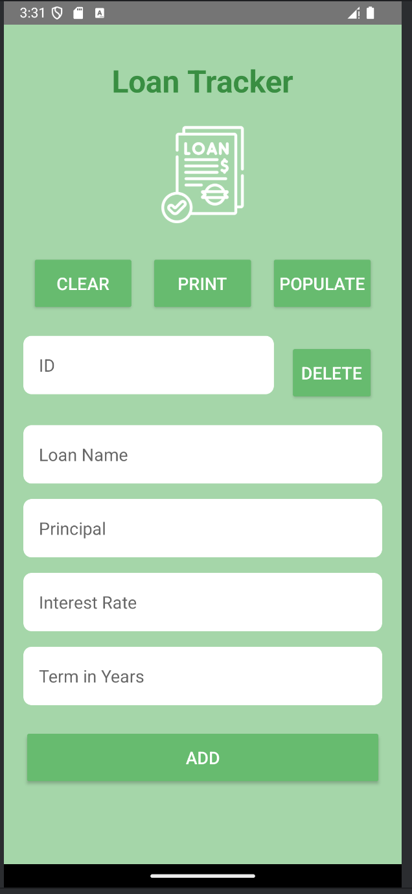

# JJLoanTracker

A streamlined Android app for tracking, managing, and visualizing loans. Features include modular loan management, add/delete/clear/populate actions, and detailed logging for every operation—all powered by Kotlin and a clean, user-friendly interface.

## Key Features

- **Modular Loan Manager**: All loan logic is encapsulated in the `LoanManager` class for easy extension and testing.
- **Add/Delete/Clear/Populate Loans**: Instantly add new loans, delete by ID, clear all, or populate with 12 demo loans.
- **Detailed Logging**: Every action (add, delete, populate, print) is logged for easy debugging and transparency.
- **Simple, Intuitive UI**: Clean layout with labeled fields and buttons for all major actions.
- **Demo Data**: App can populate with 12+ diverse loan types for demo and testing.

## Demo Gallery

Below are screenshots of JJLoanTracker running in the Android Studio emulator:




---

## Technical Highlights

### 1. LoanManager: Centralized Data Logic
```kotlin
class LoanManager {
    fun addLoan(loan: Loan) { /* ... */ }
    fun deleteLoanByID(id: Int): Boolean { /* ... */ }
    fun clearAllLoans() { /* ... */ }
    fun initializeList(loans: List<Loan>) { /* ... */ }
    fun printAllLoans() { /* ... */ }
    // ...other methods...
}
```

### 2. UI Actions & Logging
```kotlin
addButton.setOnClickListener { /* Add loan and log */ }
deleteButton.setOnClickListener { /* Delete loan and log */ }
clearButton.setOnClickListener { /* Clear all loans and log */ }
populateButton.setOnClickListener { /* Populate demo loans and log */ }
printButton.setOnClickListener { /* Print all loans and log */ }
```

### 3. Loan Data Model
```kotlin
data class Loan(
    val uniqueID: Int,
    val loanName: String,
    val principal: Double,
    val interestRate: Float,
    val termInYears: Int
)
```

## How to Use

1. **Launch the App**: The loan list is empty by default.
2. **Add Loan**: Fill in the fields and tap 'Add' to create a new loan.
3. **Delete Loan**: Enter a loan ID and tap 'Delete' to remove a loan.
4. **Clear All Loans**: Tap 'Clear' to remove all loans.
5. **Populate Demo Loans**: Tap 'Populate' to fill the list with 12 example loans.
6. **Print Loans**: Tap 'Print' to log all current loans.
7. **Customize**: Extend the data model or UI for more features!

## Project Structure

- `MainActivity.kt`: Main UI, button logic, and demo data initialization.
- `LoanManager.kt`: Centralized loan data logic and logging.
- `Loan.kt`: Data model for loans.
- `images/`: Contains screenshots for documentation.

## What Makes JJLoanTracker Unique

- **Full CRUD Actions**: Add, delete, clear, and populate—all with instant feedback and logging.
- **Transparent Logging**: Every action is logged for easy debugging and auditability.
- **Extensible Design**: Easy to add new analytics, loan types, or UI features.

## Academic Integrity

This code is my original work for UVU. Do not copy or submit as your own—doing so may result in academic consequences.
