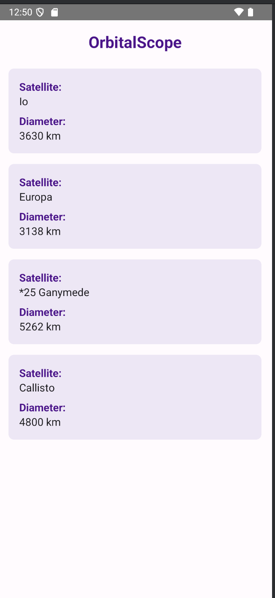

# JJOrbitalScope

A modern Android app that visualizes planetary and satellite data using Jetpack Compose and Kotlin serialization. It fetches real-time data, displays satellite information for Jupiter, and demonstrates clean Compose UI architecture.

## Key Features

- **Live Data Fetching**: Downloads and parses planetary and satellite data from a remote JSON API.
- **Jetpack Compose UI**: Built entirely with Compose for a modern, declarative UI experience.
- **Material3 Theming**: Uses custom color schemes and typography for a polished look.
- **Satellite Cards**: Each satellite is displayed in a styled card with name and diameter.
- **Robust Error Handling**: Handles network and parsing errors gracefully.

## Technical Highlights

### 1. Data Model & Fetching
- **Kotlin Serialization**: Models for `JJPlanet` and `Satellite` using `@Serializable`.
- **Coroutines**: Fetches data asynchronously with `Dispatchers.IO` and updates UI state.
- **Remote Source**: Loads data from `https://roversgame.net/cs3680/planets.json`.

### 2. Compose UI Architecture
- **MainScreen**: Displays app title and a list of satellite cards.
- **SatelliteCard**: Custom composable for each satellite's details.
- **Material3 Theme**: Custom colors and typography from `ui/theme` package.

### 3. Theming & Style
- **Purple Palette**: Uses a purple color scheme for branding and visual appeal.
- **Responsive Layout**: Padding, rounded corners, and adaptive sizing for all devices.

## How to Use

1. **Launch the App**: The app fetches and displays Jupiter's satellites automatically.
2. **View Satellite Info**: Each card shows a satellite's name and diameter in kilometers.
3. **Customize**: Extend the data model or UI for more planets or features.

## Demo Gallery

Below is a screenshot of JJOrbitalScope running in the Android Studio emulator:



## Core Implementation Snippets

### Data Fetching (MainActivity.kt)
```kotlin
suspend fun fetchSatelliteInfo(): List<Satellite> {
    return withContext(Dispatchers.IO) {
        try {
            val jsonString = URL("https://roversgame.net/cs3680/planets.json").readText()
            val planets = Json.decodeFromString<List<JJPlanet>>(jsonString)
            planets.find { it.name == "Jupiter" }?.satellites ?: emptyList()
        } catch (e: Exception) {
            emptyList()
        }
    }
}
```

### MainScreen Composable (MainActivity.kt)
```kotlin
@Composable
fun MainScreen() {
    val satelliteInfoList = remember { mutableStateOf(listOf<Satellite>()) }

    LaunchedEffect(Unit) {
        val info = fetchSatelliteInfo()
        satelliteInfoList.value = info
    }

    Column(
        modifier = Modifier
            .fillMaxSize()
            .padding(16.dp),
        horizontalAlignment = Alignment.CenterHorizontally
    ) {
        Text(
            text = "OrbitalScope",
            fontSize = 24.sp,
            fontWeight = FontWeight.Bold,
            color = Color(0xFF4A148C),
            modifier = Modifier.padding(bottom = 16.dp)
        )

        satelliteInfoList.value.forEach { satellite ->
            SatelliteCard(satellite)
        }
    }
}
```

### SatelliteCard Composable (MainActivity.kt)
```kotlin
@Composable
fun SatelliteCard(satellite: Satellite) {
    Card(
        shape = RoundedCornerShape(8.dp),
        modifier = Modifier
            .fillMaxWidth()
            .padding(vertical = 8.dp),
        colors = CardDefaults.cardColors(containerColor = Color(0xFFEDE7F6))
    ) {
        Column(
            modifier = Modifier.padding(16.dp),
            horizontalAlignment = Alignment.Start
        ) {
            Text(
                text = "Satellite:",
                fontWeight = FontWeight.Bold,
                fontSize = 16.sp,
                color = Color(0xFF4A148C)
            )
            Text(
                text = satellite.name,
                fontSize = 16.sp,
                modifier = Modifier.padding(bottom = 8.dp)
            )
            Text(
                text = "Diameter:",
                fontWeight = FontWeight.Bold,
                fontSize = 16.sp,
                color = Color(0xFF4A148C)
            )
            Text(
                text = "${satellite.diameterKm} km",
                fontSize = 16.sp
            )
        }
    }
}
```

## Project Structure

- `MainActivity.kt`: Main Compose UI and data fetching logic.
- `JJPlanetData.kt`: Data models for planets and satellites.
- `ui/theme/`: Custom Material3 color and typography definitions.
- `images/`: Contains screenshots for documentation.

## Academic Integrity

This code is my original work for UVU. Do not copy or submit as your own—doing so may result in academic consequences.
