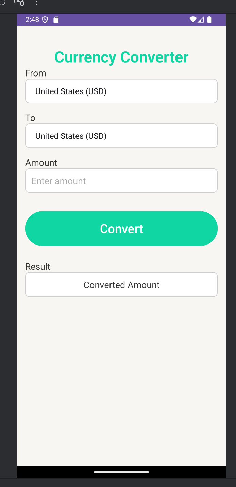
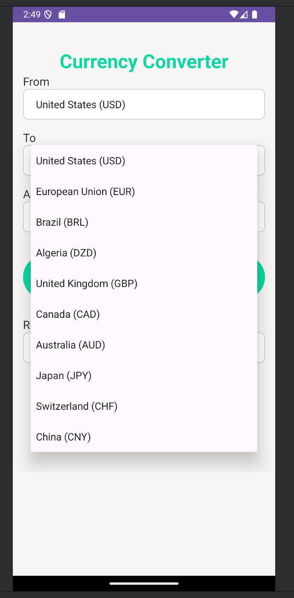
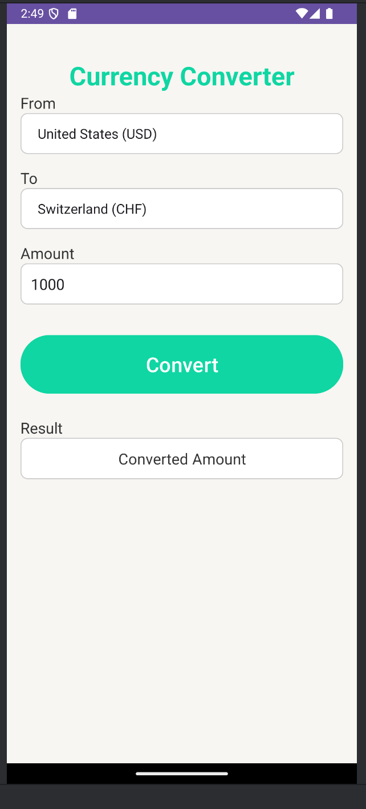
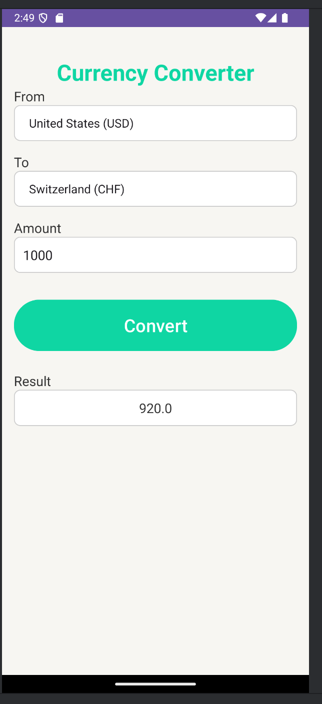
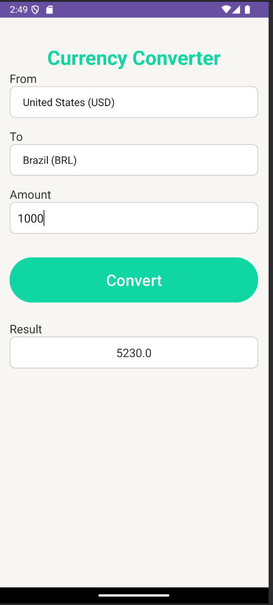
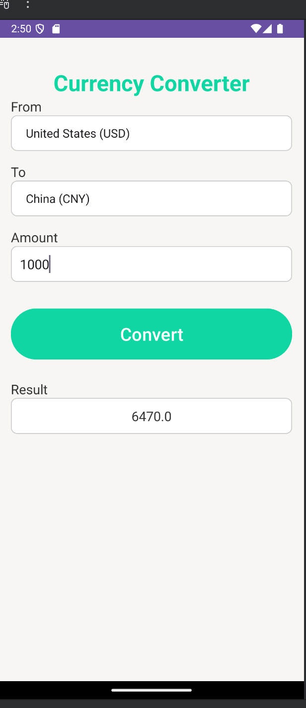

# JJUnitConverter

A robust Android currency converter app supporting 10+ currencies, with a user-friendly interface, real-time conversion, and comprehensive error handling. Built with Kotlin, this project demonstrates clean UI design, modular conversion logic, and a focus on usability and reliability.

## Key Features

- **Multi-Currency Support**: Instantly convert between USD, EUR, BRL, DZD, GBP, CAD, AUD, JPY, CHF, and CNY.
- **Bidirectional Conversion**: Supports both directions for all currency pairs with hardcoded, easily extensible rates.
- **User-Friendly UI**: Intuitive layout with labeled fields, dropdowns for currency selection, and a clear result display.
- **Real-Time Error Handling**: Detects invalid input and unsupported conversions, providing immediate feedback.
- **Extensible Logic**: Conversion logic is centralized and easy to update for new rates or currencies.
- **Tested on Modern Devices**: Designed for API 35 (Android 14) and tested on emulator and real devices.

## Demo Gallery

Below are screenshots of JJUnitConverter running in the Android Studio emulator:








---

## Technical Highlights

### 1. MainActivity: Centralized Conversion Logic
```kotlin
private fun performConversion() {
	val value = etValue.text.toString().toDoubleOrNull()
	if (value != null) {
		val fromCurrency = getCurrencyCode(spFrom.selectedItem.toString())
		val toCurrency = getCurrencyCode(spTo.selectedItem.toString())
		val result = when {
			fromCurrency == "USD" && toCurrency == "EUR" -> value * 0.85
			// ...other pairs...
			fromCurrency == toCurrency -> value
			else -> {
				tvResult.text = "Conversion not supported"
				return
			}
		}
		tvResult.text = result.toString()
	} else {
		etValue.error = "Please enter a valid number"
	}
}
```

### 2. Currency Selection with Spinners
```kotlin
val countries = arrayOf(
	"United States (USD)", "European Union (EUR)", "Brazil (BRL)", ...
)
spFrom.adapter = ArrayAdapter(this, android.R.layout.simple_spinner_dropdown_item, countries)
spTo.adapter = ArrayAdapter(this, android.R.layout.simple_spinner_dropdown_item, countries)
```

### 3. Error Handling & User Feedback
- Invalid input triggers an error on the input field.
- Unsupported conversions display a clear message in the result area.

## How to Use

1. **Launch the App**: The main screen appears with input and currency selectors.
2. **Select Currencies**: Choose the source and target currencies from the dropdowns.
3. **Enter Amount**: Input the value to convert.
4. **Convert**: Tap the "Convert" button to see the result instantly.
5. **Handle Errors**: Invalid input or unsupported conversions are clearly indicated.

## Project Structure

- `MainActivity.kt`: UI logic, conversion, and error handling.
- `images/`: Contains screenshots for documentation.

## What Makes JJUnitConverter Unique

- **Comprehensive Currency Coverage**: More currencies and pairs than typical student projects.
- **Immediate Feedback**: Real-time error and result display for a smooth user experience.
- **Extensible Design**: Easy to add new currencies or update rates.
- **Production-Ready UI**: Clean, accessible, and responsive interface.

## Academic Integrity

This code is my original work for UVU. Do not copy or submit as your own—doing so may result in academic consequences.
