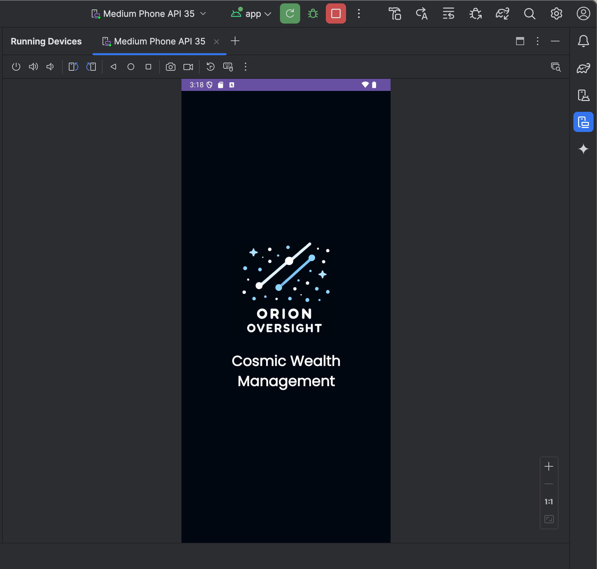
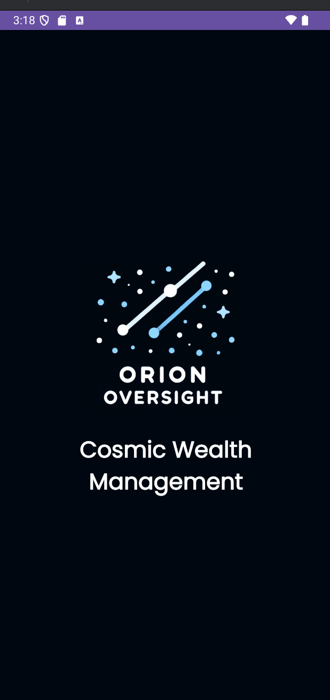

# OrionOversight

OrionOversight is a modern Android app designed as a cosmic-themed wealth management and splash screen demonstration. It features a clean, dark UI, custom branding, and a simple architecture for easy extension.

## Key Features

- **Cosmic Branding**: Custom logo, tagline, and dark theme for a unique, space-inspired look.
- **Splash Screen Logic**: Demonstrates splash screen timing and initialization using Kotlin and Logcat.
- **Material3 UI**: Uses Material3 DayNight theme for a modern, accessible appearance.
- **Simple, Extensible Architecture**: Clean MainActivity and layout, ready for further development.

## Technical Highlights

### 1. Theming & Layout
- **Dark Theme**: Uses a deep space background (`#000710`) and bold white text for high contrast.
- **Custom Font**: Integrates the Poppins font for a modern, readable look.
- **Logo & Tagline**: Centralized logo and tagline in the main layout for strong branding.

### 2. MainActivity Logic
- **Splash Duration Variable**: Demonstrates use of a local float variable for splash timing.
- **Logcat Initialization**: Prints a custom message to Logcat on startup for debugging and demonstration.

### 3. Android Best Practices
- **Separation of Concerns**: UI and logic are cleanly separated.
- **Resource Usage**: All strings, colors, and fonts are defined in resource files for easy localization and theming.

## How to Use

1. **Launch the App**: The splash screen and branding are displayed on startup.
2. **Observe Logcat**: Initialization message with splash duration appears in Logcat for verification.
3. **Customize**: Use the provided structure to add features, screens, or business logic as needed.

## Demo Gallery

Below are screenshots of OrionOversight running in the Android Studio emulator:




## Core Implementation Snippets

### MainActivity (Kotlin)
```kotlin
class MainActivity : AppCompatActivity() {
	override fun onCreate(savedInstanceState: Bundle?) {
		super.onCreate(savedInstanceState)
		setContentView(R.layout.activity_main)

		// Define a local variable for the splash screen duration
		val splashDuration = 3.5f // Unique float variable for splash screen duration in seconds

		// Print a message to LogCat using string interpolation
		Log.i("CS3680", "OrionOversight initialized. Splash screen duration: $splashDuration seconds.")
	}
}
```

### Main Layout (activity_main.xml)
```xml
<LinearLayout
	android:layout_width="match_parent"
	android:layout_height="match_parent"
	android:background="#000710"
	android:gravity="center"
	android:orientation="vertical">

	<ImageView
		android:id="@+id/logoImageView"
		android:layout_width="200dp"
		android:layout_height="200dp"
		android:src="@drawable/icon"
		android:contentDescription="@string/logo_desc" />

	<TextView
		android:id="@+id/taglineTextView"
		android:layout_width="wrap_content"
		android:layout_height="wrap_content"
		android:gravity="center"
		android:layout_marginTop="20dp"
		android:text="@string/tagline"
		android:textColor="#FFFFFF"
		android:textSize="28sp"
		android:textStyle="bold"
		android:fontFamily="@font/poppins_regular" />
</LinearLayout>
```

### Strings (strings.xml)
```xml
<resources>
	<string name="app_name">ORION OVERSIGHT</string>
	<string name="logo_desc">Logo of Orion Oversight</string>
	<string name="tagline">Cosmic Wealth Management</string>
</resources>
```

## Project Structure

- `MainActivity.kt`: Handles initialization and splash logic.
- `activity_main.xml`: Defines the main UI layout.
- `images/`: Contains screenshots for documentation.
- `res/values/`: Strings, colors, and themes.
- `res/font/`: Custom font files.

## Academic Integrity

This code is my original work for UVU. Do not copy or submit as your own—doing so may result in academic consequences.
